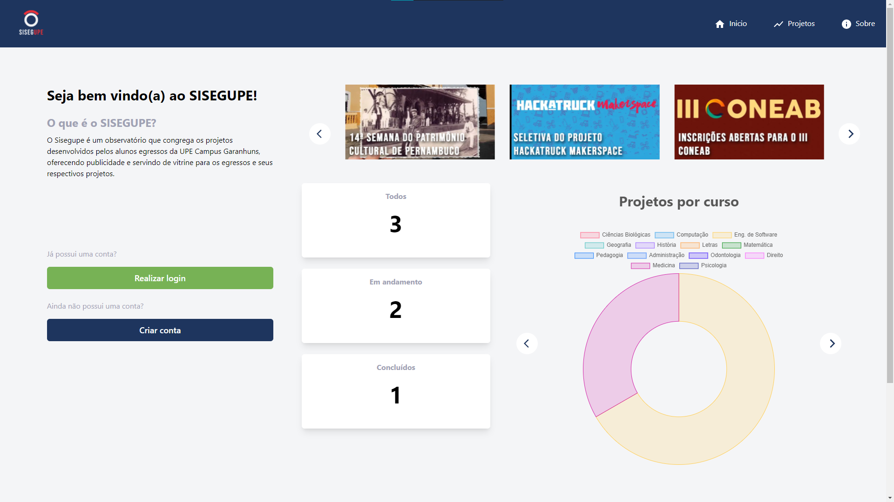
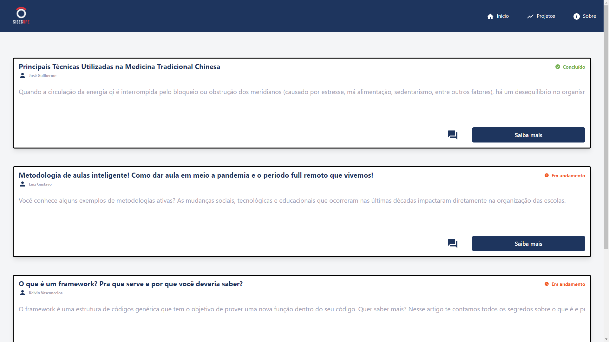

   

<h1 align="center"> :mag_right: Sisegupe </h1>

  

  
  
   
   

> ⏰ O **Sisegupe** é um _observatório que congrega os projetos desenvolvidos pelos alunos egressos da UPE Campus Garanhuns, oferecendo publicidade e servindo de vitrine para os egressos e seus respectivos projetos_.

  O projeto Sisegupe. Foi construído com ❤︎ por
    <a href="https://github.com/tonicprism">Luiz Gustavo, </a>
    <a href="https://github.com/MurylloEx">Muryllo Pimenta, </a>
    <a href="https://github.com/KelvinVasconcelos">Kelvin Vasconcelos </a>
    <a href="https://github.com/Wolf-gangSE">e Lucas Henrique</a>
  

# :pushpin: Tabela de Conteúdo

- [Screenshots](#camera_flash-screenshots)
- [Tecnologias](#computer-technologies)
- [Artefatos](#monocle_face-artefatos)
- [Site](#construction_worker-how-to-run)
- [Issues (Problemas)](#bug-issues)

# 📸 Screenshots

   

   

   

   

# 🧐 Artefatos

- [Telas do protótipo](https://www.figma.com/file/9sv1E3Ni1IEJbIUGKpKptb/ACE-IV?node-id=0%3A1)
- [Documento de Requisitos](https://docs.google.com/document/d/1qIx8YwccQ5LlimZONoryeNX2JD2nnLVM/edit?usp=sharing&ouid=105969994372846157930&rtpof=true&sd=true)

# :computer: Tecnologias

Este projeto foi feito utilizando as seguintes tecnologias:

- [NodeJS](https://nodejs.org/pt-br/)
- [SQLite](https://www.sqlite.org/index.html)
- [React](https://pt-br.reactjs.org/)
- [NextJS](https://nextjs.org/)
- [Figma](https://www.figma.com/)

# :construction_worker: Site [EM DESENVOLVIMENTO]

- Acesse o [Sisegupe]().
# :bug: Issues (Problemas)

Sinta-se à vontade para **registrar um novo problema** com um título e descrição respectivos no repositório [Sisegupe](https://github.com/MurylloEx/Sisegupe/issues).

# ✌ Feito com 💙 por [Luiz Gustavo](https://github.com/tonicprism/), [Muryllo Pimenta](https://github.com/MurylloEx), [Kelvin Vasconcelos](https://github.com/KelvinVasconcelos) e [Lucas Henrique](https://github.com/Wolf-gangSE)

Deixe uma ⭐️ se gostou desse projeto!
